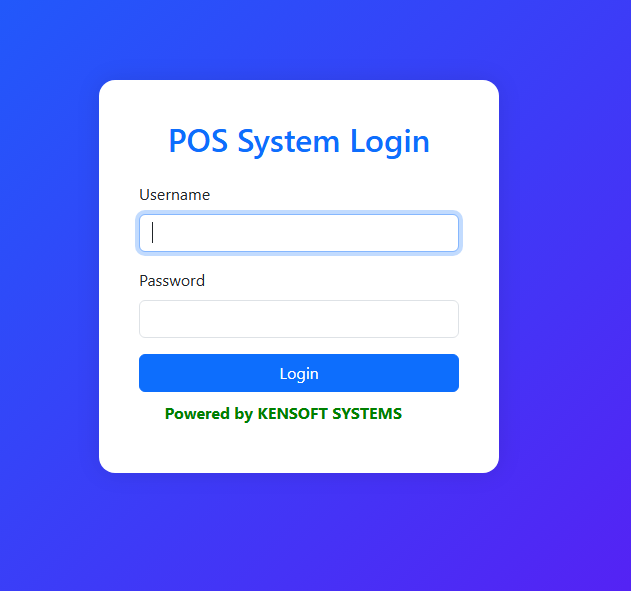
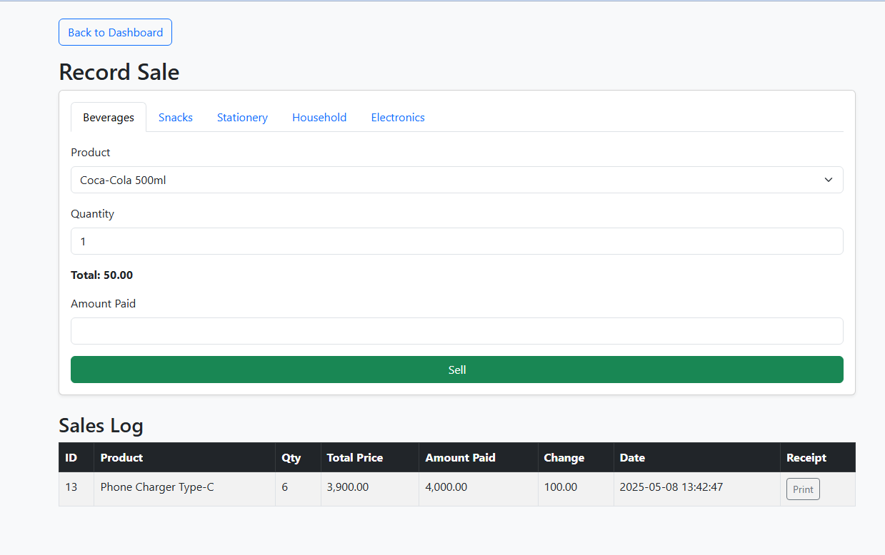
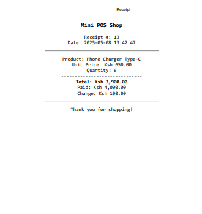
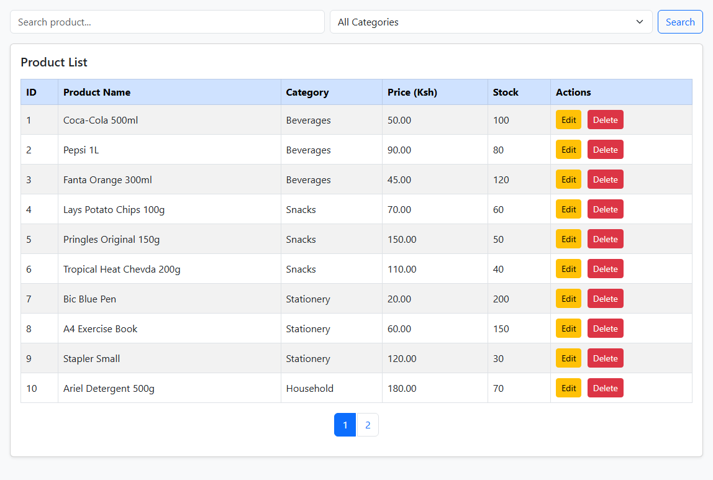

# 🧾 POS (Point of Sale) System — PHP & MySQL

A simple and efficient Point of Sale (POS) system built with **PHP** and **MySQL** This system helps manage products, inventory, and sales in small retail businesses.






---

## 🚀 Features

- 🧑‍💼 **Login**
  - Secure authentication
  - Session-based access control

- 📦 **Inventory Management**
  - Add, update, and delete products
  - Category and quantity tracking
  - Low stock alerts

- 🛒 **Sales Management**
  - Product selection and checkout
  - Invoice generation
  - Auto stock deduction on sales

- 📊 **Reports**
  - Daily sales reports
  - Product-wise sales summary
  - Export to Excel/PDF (if enabled)

- 🔎 **Product Search & Filtering**
  - Search by product name or category
  - AJAX-based filters (optional)

---
Contact me incase of anything ----Whatsapp +254729529410---
Support---donate---paypay---muthominyagah594@gmail.com
## 🛠️ Installation & Setup

### 🧰 Requirements

- PHP 7.4 or later  
- MySQL 5.7+  
- Apache (XAMPP/WAMP/LAMP stack)

### ⚙️ Setup Steps

1. **Clone or Download the Project**
   ```bash
   git clone https://github.com/yourusername/pos-system.git
   cd pos-system
